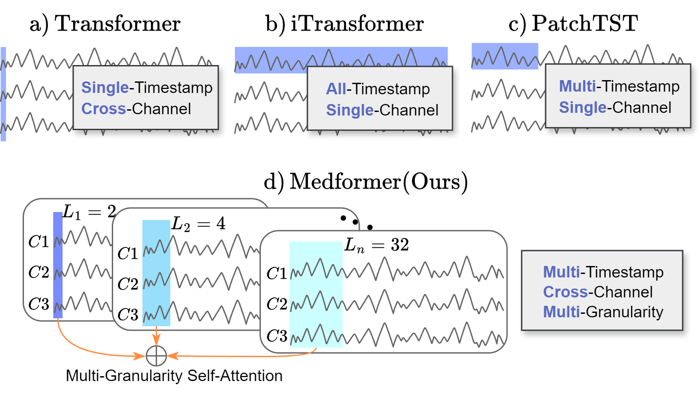
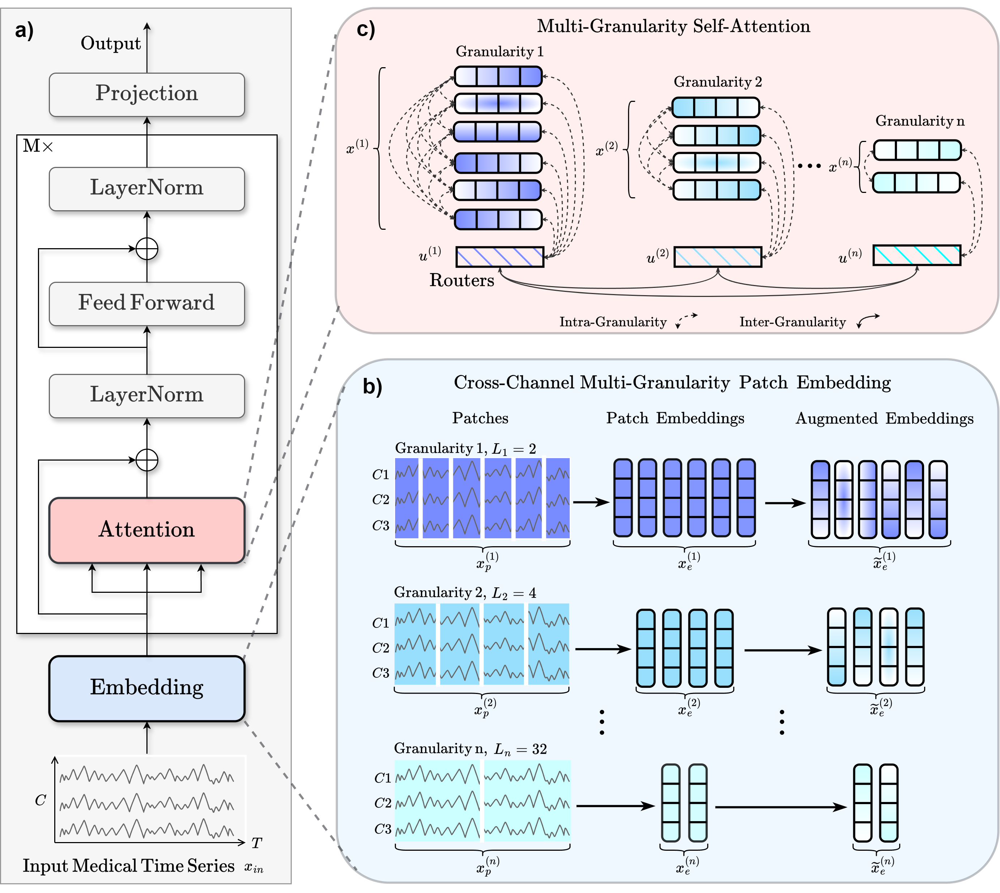

# Medformer: A Multi-Granularity Patching Transformer for Medical Time-Series Classification (Neurips 2024)

#### Authors: 
#### [Yihe Wang*](https://scholar.google.com/citations?user=1JRRcVkAAAAJ&hl=en)(ywang145@charlotte.edu), [Nan Huang*](https://github.com/TeddyHuang-00)(nhuang1@charlotte.edu), [Taida Li*](https://webpages.charlotte.edu/tli14/)(tli14@charlotte.edu),
####  [Yujun Yan](https://sites.google.com/umich.edu/yujunyan/home)(yujun.yan@dartmouth.edu), [Xiang Zhang](http://xiangzhang.info/)(xiang.zhang@charlotte.edu)

#### Medformer Paper: [Preprint](https://arxiv.org/pdf/2405.19363)

## Overview  
This repository contains the description of five datasets and the code of the Medformer model for the paper 
*Medformer: A Multi-Granularity Patching Transformer for Medical Time-Series Classification*. 
In this paper, we introduce Medformer, a multi-granularity patching transformer tailored specifically for medical time series classification. 
Our method incorporates three novel mechanisms to leverage the unique characteristics of medical time series: 
cross-channel patching to leverage inter-channel correlations, multi-granularity embedding for capturing features at different scales, 
and two-stage (intra- and inter-granularity) multi-granularity self-attention for learning features and correlations within and among granularities. 
We conduct extensive experiments on five public datasets under both subject-dependent and challenging subject-independent setups. 
Results demonstrate Medformer's superiority over 10 baselines, achieving top averaged ranking across five datasets on all six evaluation metrics.


## Token Embedding Methods


**[Vanilla transformer](https://arxiv.org/pdf/1706.03762)**
, **[Autoformer](https://arxiv.org/pdf/2106.13008)**, and **[Informer](https://arxiv.org/pdf/2012.07436)** employ a single cross-channel timestamp as a token; 
**[iTransformer](https://arxiv.org/pdf/2310.06625)** utilizes an entire channel as a token; 
and **[PatchTST](https://arxiv.org/pdf/2211.14730)** and **[Crossformer](https://openreview.net/pdf?id=vSVLM2j9eie)** adopt a patch of timestamps from one channel as a token. 
For medical time series classification, we propose Medformer considering inter-channel dependencies (multi-channel), temporal properties (multi-timestamp), and multifaceted scale of temporal patterns (multi-granularity).


## Overview of Medformer


a) Workflow. b) For the input sample ${x}_{\textrm{in}}$, we apply $n$ different patch lengths in parallel to create patched features ${x}_p^{(i)}$, where $i$ ranges from 1 to $n$. 
Each patch length represents a different granularity. These patched features are then linearly transformed into ${x}_e^{(i)}$, which are subsequently augmented into $\widetilde{x}_e^{(i)}$.
c) We obtain the final patch embedding ${x}^{(i)}$ by fusing augmented $\widetilde{{x}}_e^{(i)}$ with the positional embedding ${{W}}{\text{pos}}$ and the granularity embedding ${W}{\text{gr}}^{(i)}$.
Additionally, we design a granularity-specific router ${u}^{(i)}$ to capture integrated information for its respective granularity. 
We compute both intra-granularity attention, which concentrates within individual granularities, and inter-granularity attention, which leverages the routers to focus across different granularities, for extensive representation learning.


## Datasets
### Data preprocessing
[APAVA](https://osf.io/jbysn/) is a public EEG time series dataset with 2 classes and 23 subjects, including 12 Alzheimer's disease patients and 11 healthy control subjects. 
On average, each subject has 30.0 ± 12.5 trials, with each trial being a 5-second time sequence consisting of 1280 timestamps across 16 channels. 
Before further preprocessing, each trial is scaled using the standard scaler. Subsequently, we segment each trial into 9 half-overlapping samples, where each sample is a 1-second time sequence comprising 256 timestamps. 
This process results in 5,967 samples. Each sample has a subject ID to indicate its originating subject. 
For the training, validation, and test set splits, we employ the subject-independent setup. 
Samples with subject IDs {15,16,19,20} and {1,2,17,18} are assigned to the validation and test sets, respectively. 
The remaining samples are allocated to the training set.

[TDBrain](https://brainclinics.com/resources/) is a large permission-accessible EEG time series dataset recording brain activities of 1274 subjects with 33 channels. 
Each subject has two trials: one under eye open and one under eye closed setup. 
The dataset includes a total of 60 labels, with each subject potentially having multiple labels indicating multiple diseases simultaneously. 
In this paper, we utilize a subset of this dataset containing 25 subjects with Parkinson’s disease and 25 healthy controls, all under the eye-closed task condition. 
Each eye-closed trial is segmented into non-overlapping 1-second samples with 256 timestamps, and any samples shorter than 1-second are discarded. 
This process results in 6,240 samples. Each sample is assigned a subject ID to indicate its originating subject. 
For the training, validation, and test set splits, we employ the subject-independent setup. 
Samples with subject IDs {18,19,20,21,46,47,48,49} are assigned to the validation set, while samples with subject IDs {22,23,24,25,50,51,52,53} are assigned to the test set. 
The remaining samples are allocated to the training set.

[ADFTD](https://openneuro.org/datasets/ds004504/versions/1.0.6) is a public EEG time series dataset with 3 classes, including 36 Alzheimer's disease (AD) patients, 23 Frontotemporal Dementia (FD) patients, and 29 healthy control (HC) subjects. 
The dataset has 19 channels, and the raw sampling rate is 500Hz. Each subject has a trial, with trial durations of approximately 13.5 minutes for AD subjects (min=5.1, max=21.3), 12 minutes for FD subjects (min=7.9, max=16.9), and 13.8 minutes for HC subjects (min=12.5, max=16.5). 
A bandpass filter between 0.5-45Hz is applied to each trial. We downsample each trial to 256Hz and segment them into non-overlapping 1-second samples with 256 timestamps, discarding any samples shorter than 1 second. 
This process results in 69,752 samples. For the training, validation, and test set splits, we employ both the subject-dependent and subject-independent setups. 
For the subject-dependent setup, we allocate 60%, 20%, and 20% of total samples into the training, validation, and test sets, respectively. 
For the subject-independent setup, we allocate 60%, 20%, and 20% of total subjects with their corresponding samples into the training, validation, and test sets.

[PTB](https://physionet.org/content/ptbdb/1.0.0/) is a public ECG time series recording from 290 subjects, with 15 channels and a total of 8 labels representing 7 heart diseases and 1 health control.
The raw sampling rate is 1000Hz. For this paper, we utilize a subset of 198 subjects, including patients with Myocardial infarction and healthy control subjects.
We first downsample the sampling frequency to 250Hz and normalize the ECG signals using standard scalers. 
Subsequently, we process the data into single heartbeats through several steps. 
We identify the R-Peak intervals across all channels and remove any outliers. 
Each heartbeat is then sampled from its R-Peak position, and we ensure all samples have the same length by applying zero padding to shorter samples, with the maximum duration across all channels serving as the reference. 
This process results in 64,356 samples. For the training, validation, and test set splits, we employ the subject-independent setup. 
Specifically, we allocate 60%, 20%, and 20% of the total subjects, along with their corresponding samples, into the training, validation, and test sets, respectively.

[PTB-XL](https://physionet.org/content/ptb-xl/1.0.3/) is a large public ECG time series dataset recorded from 18,869 subjects, with 12 channels and 5 labels representing 4 heart diseases and 1 healthy control category.
Each subject may have one or more trials. To ensure consistency, we discard subjects with varying diagnosis results across different trials, resulting in 17,596 subjects remaining. 
The raw trials consist of 10-second time intervals, with sampling frequencies of 100Hz and 500Hz versions. 
For our paper, we utilize the 500Hz version, then we downsample to 250Hz and normalize using standard scalers. 
Subsequently, each trial is segmented into non-overlapping 1-second samples with 250 timestamps, discarding any samples shorter than 1 second. 
This process results in 191,400 samples. For the training, validation, and test set splits, we employ the subject-independent setup. 
Specifically, we allocate 60%, 20%, and 20% of the total subjects, along with their corresponding samples, into the training, validation, and test sets, respectively.

### Processed data
Download the raw data from the links above and run notebooks in the folder `data_preprocessing/` for each raw dataset to get the processed dataset. 
The folder for processed datasets has two directories: `Feature/` and `Label/`. 
The folder `Feature/` contains files named in the format `feature_ID.npy` files for all the subjects, where ID is the patient ID. 
Each`feature_ID.npy` file contains samples belonging to the same subject and stacked into a 3-D array with shape [N-sample, T, C], where N-sample denotes the number of samples in the subject with XX ID, T denotes the timestamps for a sample, and C denotes the number of channels. 
Notice that different subjects may have different numbers of samples.
The folder `Label/` has a file named `label.npy`. This label file is a 2-D array with shape [N-subject, 2], where N-subject denotes the number of subjects. The first column is the subject's label(e.g., healthy or AD), and the second column is the subject ID, ranging from 1 to N-subject.  

The processed data should be put into `dataset/DATA_NAME/` so that each subject file can be located by `dataset/DATA_NAME/Feature/feature_ID.npy`, and the label file can be located by `dataset/DATA_NAME/Label/label.npy`.  

The processed datasets can be manually downloaded at the following links.
* APAVA dataset: https://drive.google.com/file/d/1FKvUnB8qEcHng7J9CfHaU7gqRLGeS7Ea/view?usp=drive_link
* ADFTD dataset: https://drive.google.com/file/d/1QcX_M58IQUBn3lDBlVVL0SDN7_QI1vWe/view?usp=drive_link
* PTB dataset: https://drive.google.com/file/d/14fBIXc2gSHm00wLaejNIsPgitc-wZdXu/view?usp=drive_link
* PTB-XL dataset: https://drive.google.com/file/d/1whskRvTZUNb1Qph2SeXEdpcU2rQY0T1E/view?usp=drive_link

Since TDBrain need permission to get access first, we do not provide a download link here. 
Users need to request permission to download the raw data on the TDBrain official website and preprocess it with the jupyter notebook we provided.


## Experimental setups
We evaluate our model in two settings: subject-dependent and subject-independent.
In the subject-dependent setup, samples from the same subject can appear in both the training and test sets, causing information leakage. 
In a subject-independent setup, samples from the same subject are exclusively in either the training or test set, which is
more challenging and practically meaningful but less studied.

We compare with 10 time series transformer baselines: 
[Autoformer](https://github.com/thuml/Autoformer),
[Crossformer](https://github.com/Thinklab-SJTU/Crossformer),
[FEDformer](https://github.com/MAZiqing/FEDformer),
[Informer](https://github.com/zhouhaoyi/Informer2020),
[iTransformer](https://github.com/thuml/iTransformer),
[MTST](https://github.com/networkslab/MTST),
[Nonstationary_Transformer](https://github.com/thuml/Nonstationary_Transformers),
[PatchTST](https://github.com/yuqinie98/PatchTST),
[Reformer](https://github.com/lucidrains/reformer-pytorch),
[Transformer](https://github.com/jadore801120/attention-is-all-you-need-pytorch). 
We implement our method and all the baselines based on the [Time-Series-Library](https://github.com/thuml/Time-Series-Library) project from Tsinghua University, 
which integrates all methods under the same framework and training techniques to ensure a relatively fair comparison.


## Requirements  
  
The recommended requirements are specified as follows:  
* Python 3.8  
* Jupyter Notebook  
* einops==0.4.0
* matplotlib==3.7.0
* numpy==1.23.5
* pandas==1.5.3
* patool==1.12
* reformer-pytorch==1.4.4
* scikit-learn==1.2.2
* scipy==1.10.1
* sktime==0.16.1
* sympy==1.11.1
* torch==2.0.0
* tqdm==4.64.1
* wfdb==4.1.2
* neurokit2==0.2.9
* mne==1.6.1 
* natsort~=8.4.0
  
The dependencies can be installed by:  
```bash  
pip install -r requirements.txt
```


## Run Experiments
Before running, make sure you have all the processed datasets put under `dataset/`. For Linux users, run each method's shell script in `scripts/classification/`. 
You could also run all the experiments by running the `meta-run.py/` file, which the method included in _skip_list_ will not be run.
For Windows users, see jupyter notebook `experimenets.ipynb`. All the experimental scripts are provided cell by cell. 
The gpu device ids can be specified by setting command line `--devices` (e,g, `--devices 0,1,2,3`). 
You also need to change the visible gpu devices in script file by setting `export CUDA_VISIBLE_DEVICES` (e,g, `export CUDA_VISIBLE_DEVICES=0,1,2,3`). 
The gpu devices specified by commend line should be a subset of visible gpu devices.


After training and evaluation, the saved model can be found in`checkpoints/classification/`; 
and the results can be found in  `results/classification/`. 
You can modify the parameters by changing the command line. 
The meaning and explanation of each parameter in command line can be found in `run.py` file. 
Since APAVA is the smallest dataset and faster to run, 
it is recommended to run and test our code with the APAVA dataset to get familiar with the framework.


## Acknowledgement

This codebase is constructed based on the repo: [Time-Series-Library](https://github.com/thuml/Time-Series-Library).
Thanks a lot for their amazing work on implementing state-of-arts time series methods!
